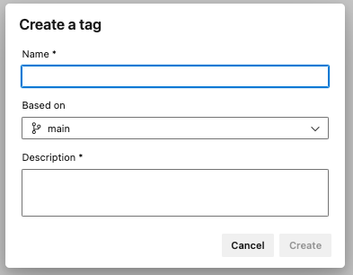

A common scenario when integrating security in development activities, such as SAST scans covered in my previous blog post, is to create a reusable template that can be referenced from pipelines.

If you are new to templates I suggest you take a look at this article from Microsoft before reading further.

<!-- more -->

When using templates though, you will soon realize that you need a way of keeping apart the different versions you might want to have in place. These might include small patches you make, minor improvements or even new features. For example, you might want to expand the template being used by several repositories in your organization, but you don't want to break any pipelines. Moreover, you don't want to force everyone to use the newest version of your template, but you want development teams to rather choose when to migrate to the newest version available. That is when versioning through "tagging" comes in handy.

<br>

## How to create tags

You can simply create tags by navigating to "Repo" -> "Tags" and then selecting "new tag", which will show to following popup window:

<br>



<br>

By the time you hit create you will have a new tag for the source code of your repository; that is a version you can reference to from another pipeline. of course you find all your repository tags under "Tags" in your Azure DevOps repository.

<br>

## How to reference tags

The next step is to actually reference the desired tag, or version, from a pipeline. To do that, you first need to include the templated repository as a resource. In our previous example we did this with the following piece of code:

```yaml
trigger: none

pool:
  vmImage: windows-latest

resources:
  repositories:
    - repository: appsecguy
      type: git
      name: appsecguy

steps:
  - task: Maven@4
    inputs:
      mavenPomFile: 'pom.xml'
      publishJUnitResults: true
      testResultsFiles: '**/surefire-reports/TEST-*.xml'
      javaHomeOption: 'JDKVersion'
      jdkVersionOption: '1.17'
      mavenVersionOption: 'Default'
      mavenAuthenticateFeed: false
      effectivePomSkip: false
      sonarQubeRunAnalysis: false

  # Run Veracode pipeline scan
  - template: templates/veracide-policy-scan.yml@appsecguy
    parameters:
      artifacts: './target/wegboat-2023.5-SNAPSHOT.jar' 
      Veracode_Api_Id: '$(VeracodeApiId)'
      Veracode_Api_Key: '$(VeracodeApiKey)'

```

Notice the "resources" section which is where we define the repository appsecguy containing our templates. The only addition needed to reference a specific tag is to add "ref" as shown below:

```yaml
resources:
  repositories:
    - repository: appsecguy
      type: git
      name: appsecguy
      ref: refs/tags/v1.0
```

Assuming I have created a tag called v1.0 for the first version of my SAST template, I can now reference that version as shown above. The rest of the code will remain the same.

<br>

### Benefits

Then main benefit having a references to tagged templates as described above is that you can push different versions of your templates, leaving the update decisions to the development teams. It should also offer you the flexibility of testing out new features easier without breaking literally every pipeline.

I have seen companies wishing to have only one main version that is forced on every development team. This has of course the benefit of keeping everybody to the "bleeding edge", but at the same time requires effort to maintain everything is a manner that it rarely breaks, for example by maintaing all development pipelines for the developer teams, instead of the development teams being responsible for their own pipelines.
