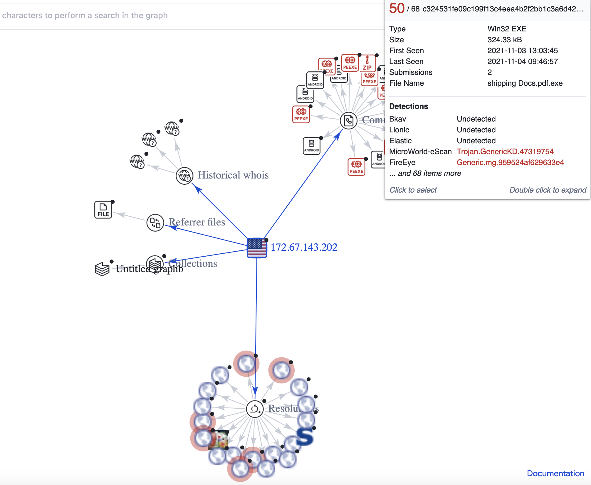

I haven't written a blog post for some time now, so here we go: Security analysis of emails!

<!-- more -->

## Why security analysis of emails

This blog post is an introduction on how to perform a basic email security analysis. When working in cybersecurity we constantly come across emails that look suspicious, have phishy links, contain malware, want to harvest credentials, want to scam people etc. 

You should definitely invest on shielding your company or yourself against what I will now call "email attacks". However, even when using email security solutions phishinging email will occasionally find their way through protections and make it to the victim's inbox. You might even find a particularly interesting case that you would like to analyze in detail. Having basic skills to analyze emails is therefore important.

## Email Headers Analysis

Email headers will help you understand how the email made it to your tenant. What IP did it come from? which domain? Which is the provider of the source IP address. You can analyze headers using one of these tools:

- [Google](https://toolbox.googleapps.com/apps/messageheader/)
- [mha](https://mha.azurewebsites.net/)

Of course there are plenty more options out there. If you need to find further information about a particular IP address head to [HE](https://bgp.he.net/) and use the search function.

Using this set of tools you should be able to understand what the source IP is, the destination IP but also whether SPF and DKIM checks succeeded or not, among other valuable information that can help you evaluate an email. 

## Hash and IP checks

You can check whether IPs are known to deliver malware or phishing emails through many services. 

Two of my favorites are:

- [VirusTotal](https://www.virustotal.com/gui/home/upload)
- [AbuseIPDB](https://www.abuseipdb.com/)

In particular, using virus total you can check file hashes that might be contained in the suspected email. On top of that, I like the VT graph capabilities that help you understand how one of the data you are analysing, such as IPs and subdomains, are related to other components (certificates, domains, malware, IPs etc). Here is an example for one IP address I investigated which clearly shows me that the IP was used in the past to deliver malware:

## Other sources of information

Besides IP and hash values you might want to check details of the domain the email is linking to. You have a few options at this point, one of which is to analyze DNS records. A valuable tool for this is [DNSDumpster](https://dnsdumpster.com/). Besides DNS information you can also check certificates by using [Crtsh](https://crt.sh/). A common scenario is that phishing websites will use Let's Encrypt certificates that are issued very recently in relation to the time of the investigation. 

## Qualitative analysis

Besides the technical details, analyzing the quality of text and email intend will help you figure out whether a case is a false positive or an actual true positive case. 
