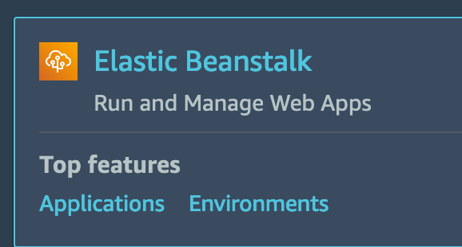
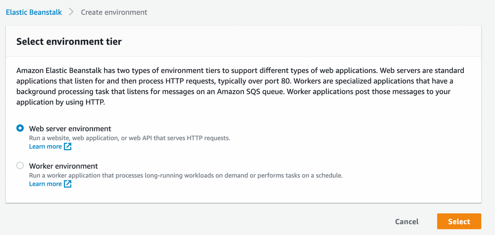
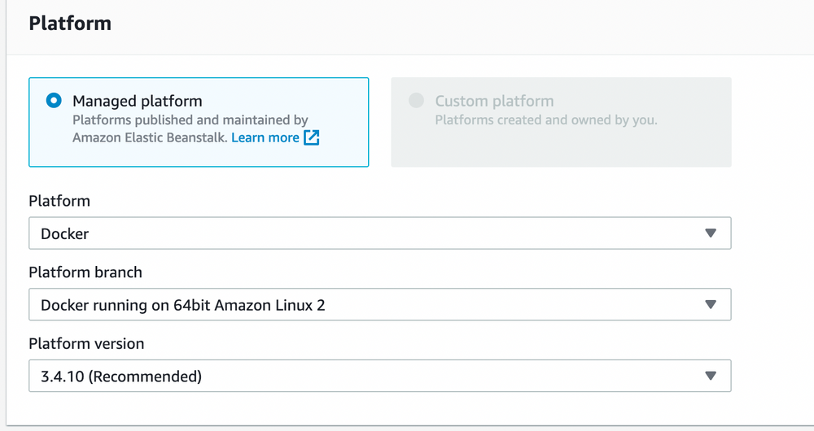
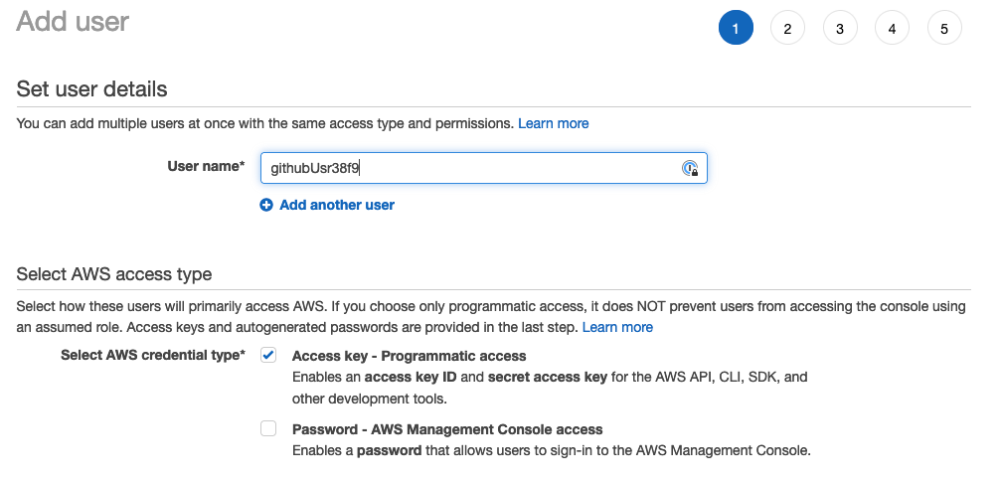
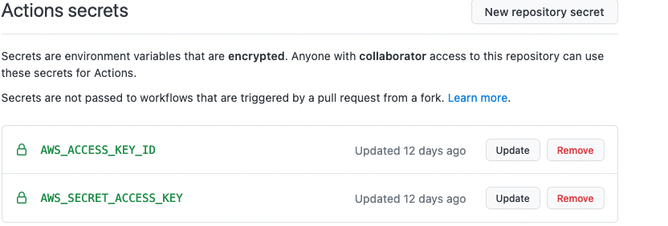

In this tutorial we will deploy our very own Django application to Amazon's Elastic Beanstalk, or else EBS. If you haven't head of AWS EBS yet go ahead and check this page. In a short summary EBS provides a fully managed environment to help you quickly deploy your web apps without working too much to get the underlying infrastructure in place. That's pretty cool!

<!-- more -->

Create your EBS environment

Let's start by creating our very own EBS environment so go ahead and log into your AWS console. Once logged in, search for Elastic Beanstalk. Go ahead and click "Create a new environment".


<br>



<br>

Next select "Web server environment".

<br>



<br>

At the next screen go ahead and pick an application name, environment name and choose the platform you want to deploy to. We choose Docker, since we will deploy a dockerized version of our Django application.

<br>




<br>
That's it, click on the create button and your EBS environment will be ready in a few minutes.

<br>


## Automate deploy with Github Actions

Next we will automate the deployment of the application using Github Actions. We will start by configuring the right access and in order to do that, go ahead and visit IAM in the AWS console. Click "Users" and then "Add Users". It is time to create the "Github User" account which is the user account that will be used by Github Actions to do the deployment.

Choose and username and then click on "Access Key - Programmatic access".

<br>



<br>

Under Permissions, choose "Attach existing policies directly" and search for beanstalk. Choosing admin rights for this user is not advisable for production environments. For my testing I used this since I did not have time tot dig into details.

<br>


<br>

The rest should be a matter of clicking "Next" until the creation of the user. When your user is created you will receive a "Secret Access Key" and an "Access Key ID". You have to add these as secrets in your Github repository as shown below.

<br>



<br>

The final step is to create the Github Actions File. You can copy the example from the snippet or the Github link below.

<br>


```
name: Docker Image CI

on:
  push:
    branches: [ main ]
  pull_request:
    branches: [ main ]

jobs:

  build:

    runs-on: ubuntu-latest

    steps:
    - uses: actions/checkout@v2
      with:
        lfs: 'true'
    - 
      name: Build the Docker image
      run: docker build -t django-blog -f Dockerfile .
    -
      name: Generate Deployment Package
      run: zip -r deploy.zip *
    -
      name: Get timestamp
      uses: gerred/actions/current-time@master
      id: current-time
        
    - name: Run string replace
      uses: frabert/replace-string-action@master
      id: format-time
      with:
        pattern: '[:\.]+'
        string: "${{ steps.current-time.outputs.time }}"
        replace-with: '-'
        flags: 'g'

    - name: Deploy to EB
      uses: einaregilsson/beanstalk-deploy@v14
      with:
        aws_access_key: ${{ secrets.AWS_ACCESS_KEY_ID }}
        aws_secret_key: ${{ secrets.AWS_SECRET_ACCESS_KEY }}
        application_name: your_app_name
        environment_name: your_env
        version_label: "maybe_your_env-${{ steps.format-time.outputs.replaced }}"
        region: eu-north-1
        deployment_package: deploy.zip
```

<br>

Find the code here:

[https://github.com/nkalexiou/code_blocks/blob/main/eb-deploy.yml?ref=appsecguy.se](https://github.com/nkalexiou/code_blocks/blob/main/eb-deploy.yml?ref=appsecguy.se)

Do not forget to put the yml file under .github/workflows in your repository.  You can find your environment and application name by visiting "Elastic Beanstalk" in your AWS console.