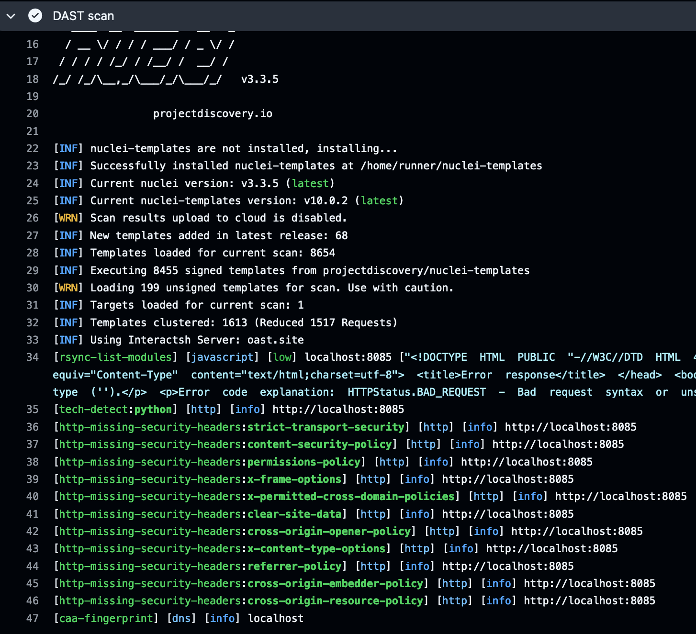

## What is DAST? 

Dynamic Application Security Testing (DAST) is a method to test a snapshot of your application for security issues. It differs from static code analysis in the sense that it focuses on functionality, or else how your application reacts to different input sent by the tool used to perform DAST. By definition it is an automated processs done by a tool that you point to the direction of your API or web interface. The tool then has payloads that will be used during test and depending on the application responses it can identify potential issues. 

<!-- more -->

## What is Nuclei

[Nuclei](https://github.com/projectdiscovery/nuclei) is an awesome open source tool that can perform DAST. It uses the concept of templates, which can be thought of as different types of tests that can be run. For example, you can use a template for specific server technlologies, CVEs, common web vulnerabilities etc. 

## Why DAST in CI/CD?

You can use DAST to scan your applications under development or those that are ready for release. You can also choose to fail pull requests and merging to the master branch if DAST scans identify high risk issues. 

## Github actions example

```yaml
name: Dynamic analysis (DAST)
on:
  push:
    branches:
      - master
  workflow_dispatch:

jobs:
  Dynamic-Analysis:
    runs-on: ubuntu-latest
    steps:
      - name: Checkout code
        uses: actions/checkout@v2
        with:
          ref: master
      
      - name: Install Docker Compose
        run: |
          sudo apt-get update
          sudo apt-get install docker-compose -y
          
      - name: Start containers
        run: docker-compose up -d --build
        
      - name: DAST scan
        uses: projectdiscovery/nuclei-action@v2.0.1
        with:
          target: http://localhost:8085
      - name: Stop suricatajs
        run: docker-compose down
          
```

The DAST scan happens in the last step, where we provide the target and define the version of the action to be used. 

You can find an example of the analysis [here](https://github.com/nkalexiou/suricatajs/actions/runs/11498390726/job/32004088011).

