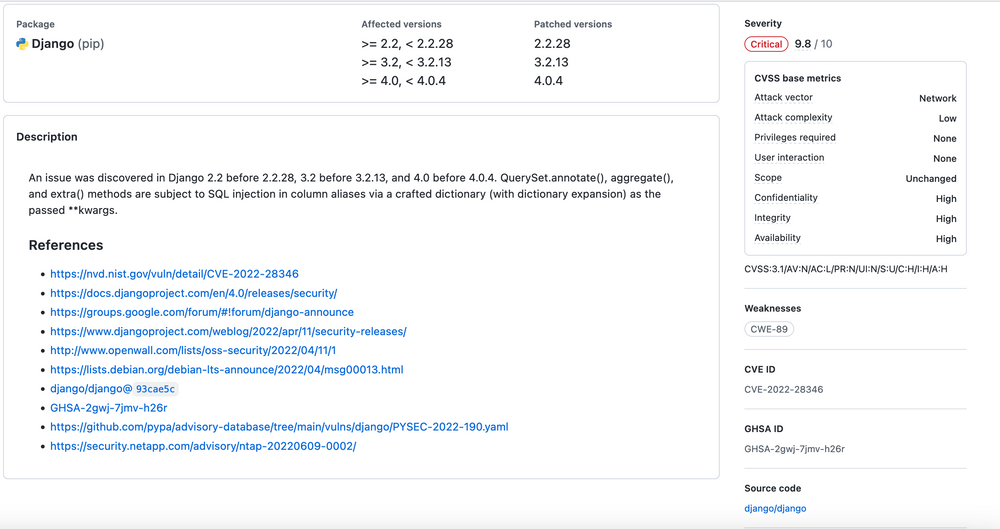
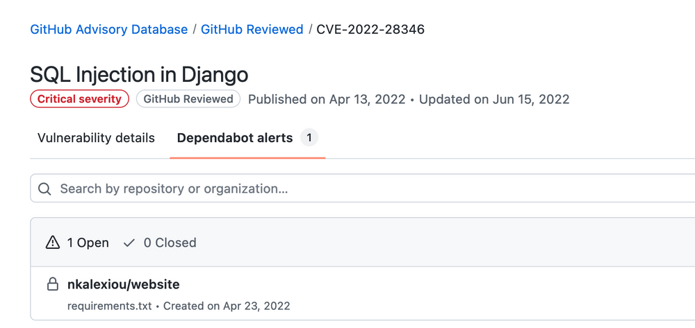

Dependabot is the way Github alerts you about security vulnerabilities in open source dependencies. The Github Advisory Database is where Dependabot draws it's knowledge from, meaning it is the database used by Dependabot to identify vulnerabilities in dependencies.

<!-- more -->

According to Microsoft Learn the Github Advisory Database is populated from the following sources:

- The National Vulnerability Database (NVD)
- A combination of machine learning and human reviews to detect vulnerabilities in public commits on GitHub.
- Security Advisories reported on Github
- The npm security database

## Why should I know?

You can access the Github Advisory Database at [https://github.com/advisories](https://github.com/advisories).

It provides an excellent collection of vulnerabilities and related articles. For example, these are the vulnerability details for one of Django's SQL Injection vulnerabilities:

 

 

As it is obvious all severity is measured using CVSS scores, which makes it easier to assess criticality.

Besides providing details on vulberabilities, Github also directly identifies affected dependencies for each vulnerability. In the previous example, Github informs me directly that one of my projects are affected:

*Dependabot alerts related to the vulnerability*

Therefore, it becomes easier to investigate reports on security issues and then check if any of your repositories are affected. It is an alternative approach to searching through all dependabot alerts affecting your organization and seeing if a particular CVE exists in the alerts.

Finally, note that Github allows you to filter vulnerabilities depending on whether the vulnerability has been reviewed by Github or not.
