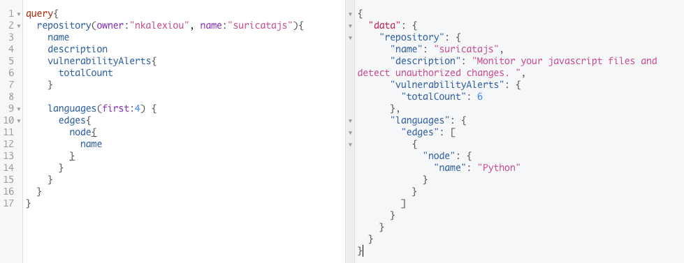
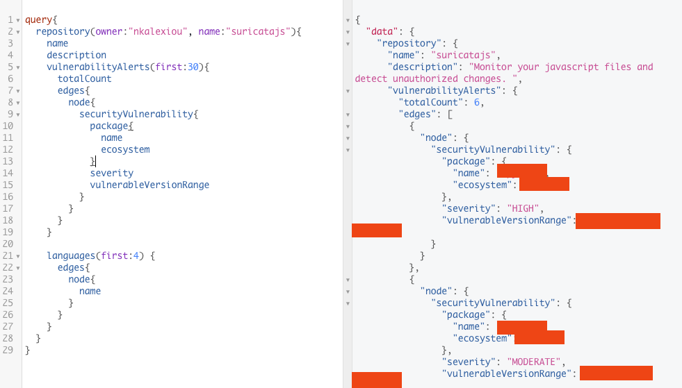
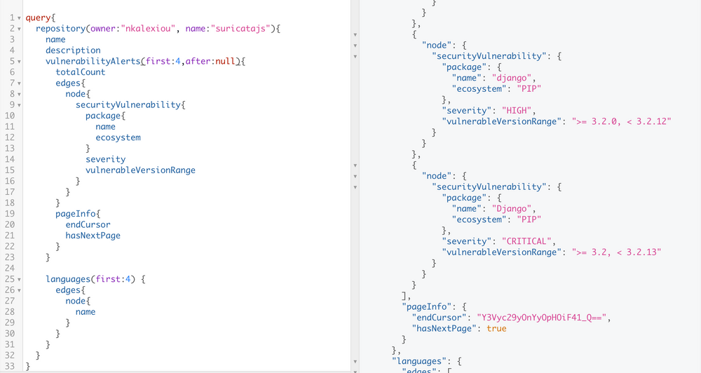
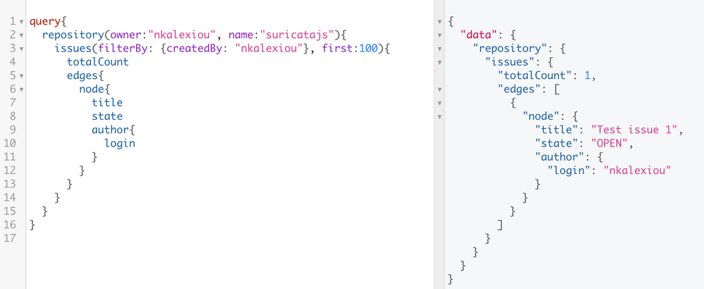
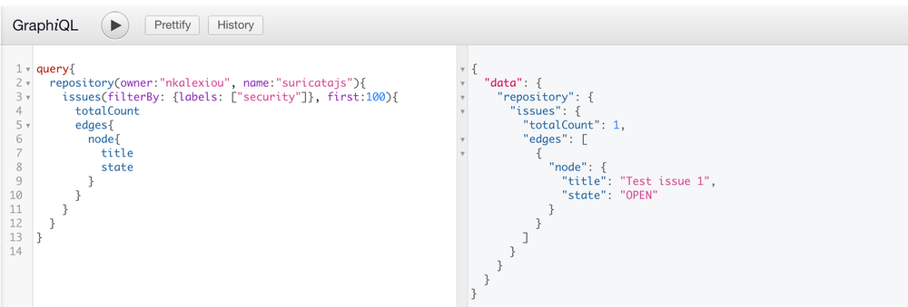

GraphQL is a powerful way of interacting with an API to fetch a data object containing all, or at least most information that you need. It resembles REST in the way it works, but it's more powerful and faster. Instead of using multiple requests to query the server for different pieces of data that need to be stitched together, GraphQL allows to fetch a single custom defined object with a single call.

<!-- more -->

If you, like me build scripts and apps to interact with APIs in order to construct AppSec metrics, you immediately realize the benefits of this approach. This is the case of course given that the application you want to interact with in order to extract metrics exposes a GraphQL API.

Github exposes a GraphQL API which makes interaction and data gathering smoother. Dependabot metrics and security related issues can be fetched with GraphQL queries which makes it possible to gather AppSec metrics.

<br>

## Github GraphQL

This post is not intended to be a GraphQL tutorial, but rather a collection of examples of how to interact with Github's API to extract AppSec data.

All documentation for Github GraphQL is found here: [https://docs.github.com/en/graphql](https://docs.github.com/en/graphql)

To interact with the API you can use the following application: [https://docs.github.com/en/graphql/guides/using-the-explorer](https://docs.github.com/en/graphql/guides/using-the-explorer)

Finally, to interact with the API you need to create a personal access token from Github and add it as a header in GraphiQL as instructed by the link above.

<br>

## Querying Dependabot data

Let's start with a simple interaction with the API to fetch the description of a repository. The query is structured as shown below by providing owner and name for the repo and defining description as the field to retrieve in the response.

<br>


<br>

Extending the previous query further, we request the total number of Dependabot vulnerabilities for this specific repository. Observe how instead of using several queries as one would do with REST in order to collect all the details, only one query is used which defines how the response should look like.

<br>


<br>

It could be interesting to see how many vulnerabilities existing in a  repository in combination with the programming language(s) being used. So the query could become as follows:

<br>



<br>

For simplicity, pagination for languages is restricted to the first 4 languages in the repository.

Finally, let's build a query that asks for more details on each Dependabot vulnerability, such as information about the package name, severity level and the vulnerable package versions. Once again, the 30 first vulnerabilities are requested for this repository for simplicity.

<br>



<br>

## Using pagination to get all results

In a real world scenario we would like to get the full range of results and not just the first 30 or 100 dependabot alerts. To do that we have to change to previous query a bit so that the response contains endCursor and hasNextPage results. The query becomes as follows:

<br>



<br>

Notice the extra section in the query that instructs the API to return the last object reference which is included in the current set of results (endCursor) and the hasNextPage boolean:

<br>

```
pageInfo {
    endCursor
    hasNextPage
}
```

<br>

To fetch the next set of results we would have to replace after:null with the id of the cursor from the result.

<br>

```
vulnerabilityAlerts(first:4, after: "Y3Vyc29yOnYyOpHOiF41_Q=="){
...

```

<br>

The whole process of receiving endCursor and querying for the next set of results can be automated for example with python.

<br>

## Summary of all repositories

A useful use case, especially in a work environment, would be to fetch all queries your user has access to and provide a summary of the number of Dependabot alerts. You could do that by the following query:

<br>


<br>

The variable querystring has to be defined as well:

<br>

```
{
  "queryString": "org:your_organization"
}
```

<br>

## Querying Github issues

Besides Dependabot alerts, we can use GraphQL to query for issues as well. Suppose that we would like to find issues created by a human user or by integration with a third party software. We can do that by filtering the results as shown below:

<br>



<br>

In case labeling is used to mark security issues we could also filter repository issues by filtering on the label used. For example, supposed that all security issues are labeled with security. We could check the status of these issues by with the following query:

<br>



<br>

## Conclusion

GraphQL is fast and can be used to directly query an API for the desired response object format. Github's GraphQL API provides a way to retrieve security information, for example about Dependabot vulnerabilities and security issues.

I hope that the previous example will be of help to get started faster with using Github's GraphQL API to extract AppSec data. You can find all code examples in the following repository:

[nkalexiou@Github](https://github.com/nkalexiou/code_blocks/tree/main/graphQL?ref=appsecguy.se)

That's all!
