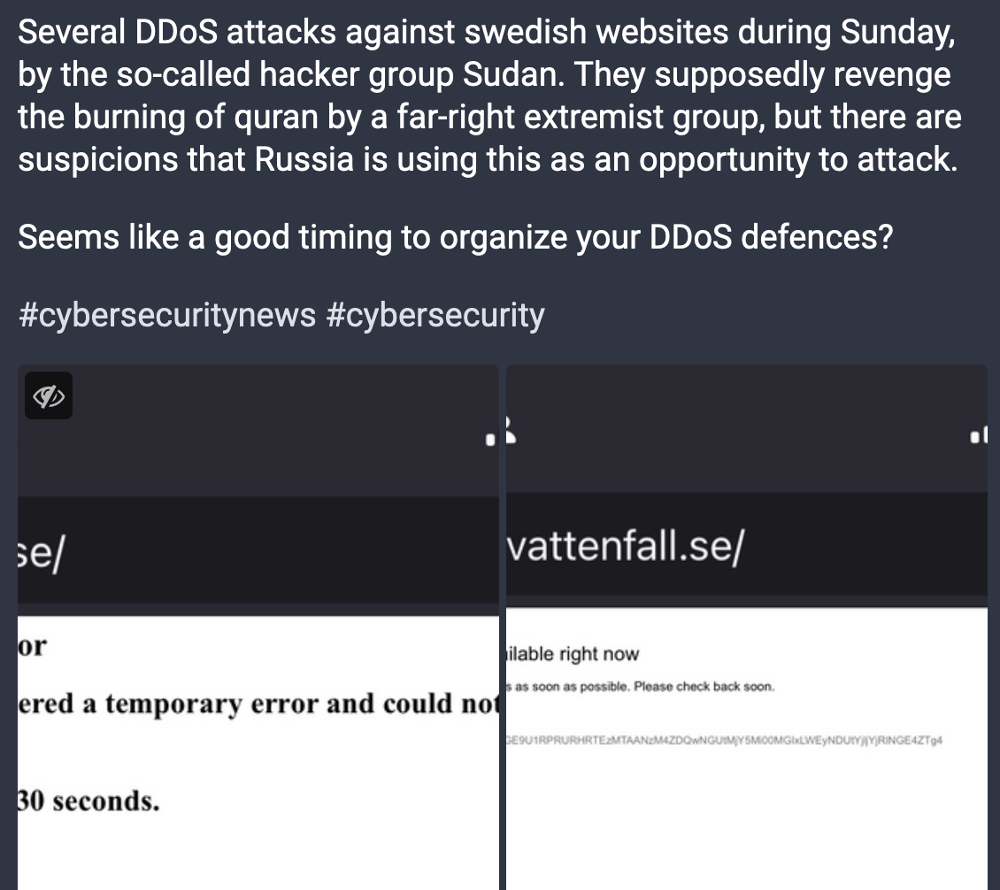
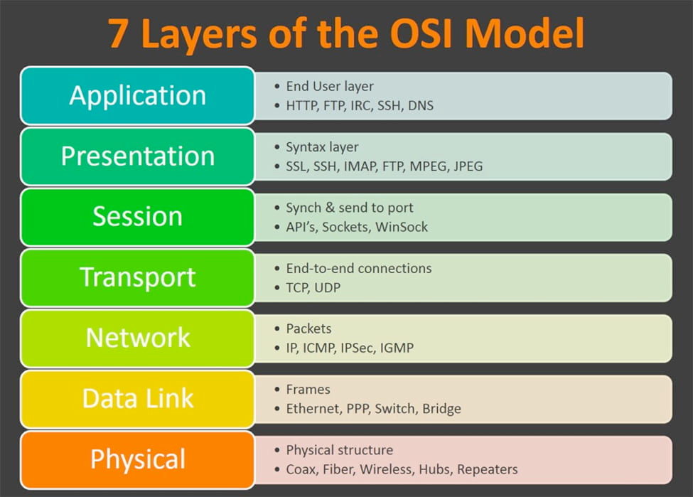

In February 2023 Sweden suffered a series of Distributed Denial-of-Service attacks (DDoS) and several Swedish websites were knocked down. A DoS is a type of attack that the attacker uses to make victim services unavailable, usually by sending large number of malicious requests. The number of incoming requests becomes so high that legitimate requests end up not being handled by the victim's services, thus the denial-of-service. DoS is also usually distributed in the sense that multiple bots (or zombies) and attacker-controlled machines take part in the attack to increase the probability of a successful attack. As reference, Cloudflare stated that it stopped a DDoS peaking 71 million requests per second in February 2023!

<!-- more -->

The Swedish websites, among others kivra and vattenfall, were targeted by the so-called Sudan group as an act of protesting actions taken by a far-right group. However, it is believed that the attacks are backed by Russia and that the hacking group Killnet, notorious for launching DDoS attacks, is behind them. The aim of Russia is of course igniting political instability and creating a sense of terror. The effectiveness of the attacks was limited as they blindly targeted the public websites, leaving critical functionality literally unaffected on several of these. If interested, you can read a few more details about the attacks that hit Sweden in the following mastodon [post](https://ioc.exchange/@appsecguy/109890744625102261?ref=appsecguy.se).

 

 

The big question though is how we protect services against DDoS and more importantly how do we protect layer 7, the application layer of the OSI model.

 

## Types of DoS attacks

If you are not aware of the OSI model, please read up the [wikipedia](https://en.wikipedia.org/wiki/OSI_model?ref=appsecguy.se) page first.

 

 

Denial-of-Service attacks come in several flavors and a can be grouped based on the OSI layer utilizing for the attack.

Starting from the lower layers, layer 3 DoS attacks utilize the network layer to overflow victims with large amounts of data. For example, in a ping flood attack the attacker sends millions of ping requests to the victim. In smurf attacks, the attacker uses spoofed ICMP requests to multiple networks using the IP of the victim as the source, in order to create a flood of incoming ICMP responses.  

Moving towards layer 4, the attacker usually utilizes the way that the TCP protocol works. Using SYN flood attacks the attacker opens a large number of TCP connections with the victim and consumes all available resources leading it to crash. The victim simply overcommits without thinking too much about it. You can read more about SYN flood attacks [here](https://www.cloudflare.com/learning/ddos/syn-flood-ddos-attack/?ref=appsecguy.se).

Then we have layer 7, the application layer which deserves its own special category in DDoS attacks. The attacker might try to flood the victim with thousands or millions of HTTP requests, or take advantage of code bugs, architecture flaws and business logic flaws that lead to the victim being unable to handle legitimate traffic.

 

## Layer 7 DDoS attacks and mitigations

Typical targets are API endpoints and web forms that interact with the backend and cause consumption of resources. The attacker might try to create massive amounts of logs thus crushing log manament system (or even causing financial damage depending on your licenses) or might create a massive influx of messages to humans or message queues. Additionally, the simple fact that thousands of requests will hit a server might stress it out at a level that it stops responding. To make matters worse, coding errors can be utilized to bring services down without even needing a massive number of incoming requests. Examples of coding errors are race conditions that might arise when exploiting system functionality, or lack of simple protections leading to easy prey for the attackers.

The most important question is therefore "How do we protect our applications at layer 7 against Denail-of-Service?". Here are several recommendations that will help you do that.

- Keep a registry of exposed services. There is nothing worse than not being able to identify which service or API is causing issues when under attack. It will be stressful anyhow, just don't make it worse by not having a registry.
- Threat model your services. Threat modeling will help you question what might go wrong including cases of DoS attacks and also what you can do about it. Also, in the STRIDE model, D stands for Denial-of-Service.
- Analyze your code for bugs. This is not only for Denial-of-Service, but it is the bare minimum needed to do in order to build protection in depth and avoid coding bugs that might cause DoS.
- Require authentication for sensitive functionality. Do not expose APIs or endpoints that consume valuable resources in public. Always require authentication, as well as enforce complete remediation for all incoming requests (authorization).
- Logically divide public and private infrastructure. Shared resources should be carefully considered. An example is shared message queues between public websites and internal services. If the attacker manages to overflow the queue through the public website then internal services face a DoS problem as well. Load balancers are another example where it is desirable for internal services to keep operational regardless of the state of the load balancer servicing external systems.
- Protect against automated bots. Automated bots can flood your web forms creating a lot of noise and causing chaos for humans and IT systems. A simple solution is to use captcha, such as the Google Recaptcha, or a Web Application Firewall (WAF) that will detect and block bots.
- Set rate limits with respect to business peak hours. You can easily achieve this with a WAF, or even from your web server configuration like in IIS. Usually, the limit is set for a maximum number of requests within a time frame per IP.
- Defence in depth. As always, don't do just one protection and only once. Several layers of protection will help you eliminate or reduce the impact of attacks.
- Centralize protections. This is something I have found helpful through the years. If you have a WAF then you know how to enable rate limit protection. If you do rate limiting from the web server configuration, then you should be doing that with infra-as-code so that you don't have to log into tens of different servers. 

Finally, implement a holistic protection against DDoS attacks covering all layers of the OSI model!
