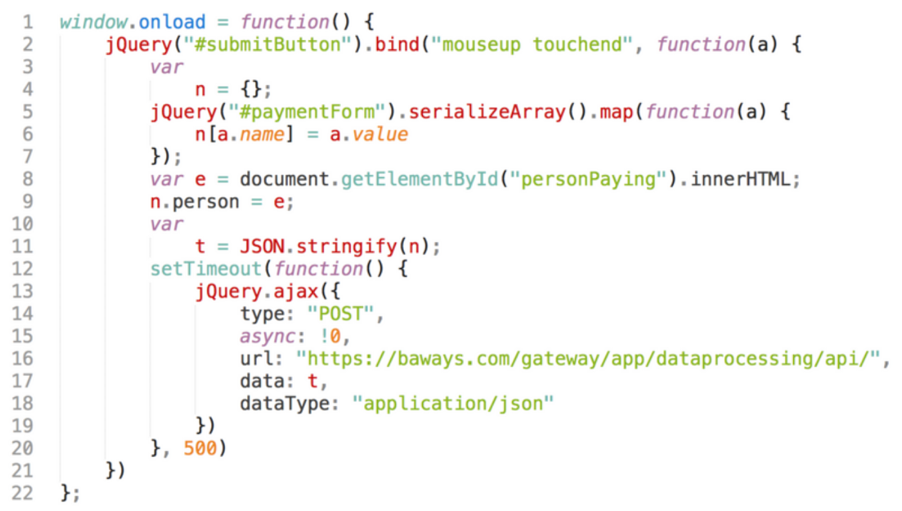
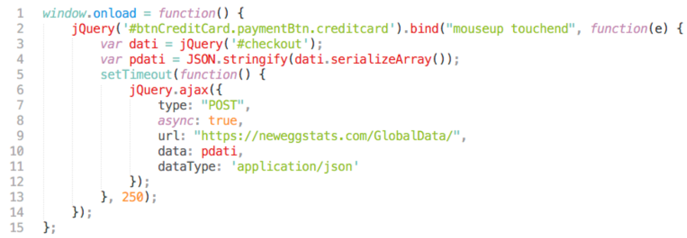

In 2019 British Airways was fined a remarkable £183 million for a data breach of its systems that affected more than 380.000 customers. Magecart, the hacking group behind the attack, specializes in credit card theft and British Airways have not been their only target. Ticketmaster, Forbes, Newegg and numerous online webshops have suffered security breaches by Magecart that share a common characteristic: a digital skimmer that steals customer credit card information without the victim’s knowledge.

<!-- more -->

In the real world, a skimmer is a small physical device inserted at payment terminals and designed to harvest data from credit cards during swipe. In the digital world, digital skimming is done through small pieces of javascript code injected in the target page that listen in on user interactions with payment forms and steal credit card information.

Credit cards have been the epicenter of such attacks because of easier loot monetization in the dark web and black markets. However, several other types of information could become monetized as well in the hands of cyber criminal groups, such as financial information, personal and corporate information and health data. Considering the number and diversity of cyber criminal groups expertise, as well as the high success rate and stealth nature of the attacks, javascript injection could soon find a broader audience.

*“Considering the number and diversity of cyber criminal groups expertise, as well as high success rate and stealth nature of the attacks, javascript injection could soon find a broader audience”*

## A history of hacks

In 2018 British airways suffered an attack from the Magecart group that managed to steal CVC codes, expiry dates and credit card numbers using 22 lines of code injected in the checkout page. The following snapshot shows the code used in the attack that creates a form reader sending stolen data to baways.com, which is a domain controlled by the attackers used to collect stolen credit card data.

*https://www.riskiq.com/blog/labs/magecart-british-airways-breach/*

Ticketmaster was not directly compromised by Magecart, but it was affected by a supply chain attack. Inbenta, which is a third party supplier for ticketmaster, was breached in 2018 and as a result hackers were able to run malware directly in ticketmaster’s payment webpages through the compromised third party component.

The online merchant Newegg was hit in a similar fashion to British airways with Magecart injecting a slimmer version of 15 lines of code this time.

*https://www.riskiq.com/blog/labs/magecart-newegg/*

Forbes is yet another example of attack using the same technique on the subscription page where customers would provide their payment details. Moreover, on June 26th 2020 Trend Micro published details about eight US local government services that had fallen victim to Magecart.

## Detecting ongoing attacks

Defense must be done in layers and not at a single point. This means implementing a series of often overlapping controls ranging from security principles and procedures, secure configuration baselines, web application scanners, keeping third party components up to date and vulnerability assessments to name just a few.

This article discusses a detection technique that can be used for monitoring production environments in order to warn companies of ongoing javascript injection attacks.

In order to inject the malicious javascript attackers have to alter javascript’s footprint on the target webpage. Practically this means that either malicious code has to be injected into existing javascript files, or the javascript skimmer has to be introduced as a new script. In both cases defenders have an opportunity to detect these changes and act quickly to restrict damage. To do this cryptographic structures called hash functions can be used.

Cryptographic hash functions are one-way functions that produce a deterministic output y for each input x. The output y remains the same as long as x remains the same and in theory y is unique for x. For example, the MD5 hash of a the file test.txt containing the phrase “Hello World!” is the following:

*hash/checksum example, MD5 is used only for illustration purposes as MD5 is vulnerable to collisions.*

*“The hash will remain the same as long as the contents of the file remain the same”*

Using this property of hash functions hashes of javascript can be calculated at regular time intervals. If the hash changes then a change in the contents of javascript is detected.

## Detection example

pizzalove.com has a checkout page where customers can enter their credit card details to order pizza. In order to support webpage functionality jquery.min.js is used included in the checkout page as follows:

openssl can be used to calculate the hash of jquery.min.js version 1.12.4 included in the webpage, using the SHA-256 hash algorithm as follows:

Now, suppose that hackers breach pizzalove’s systems and insert a digital skimmer into jquery.min.js, similar to the ones presented above. The value of the hash changes this time to another value because the attackers altered the contents of jquery.min.js:

By comparing the old hash value to the new one defenders should be able to detect a change in version 1.12.4 of jquery; a very interesting finding that should raise suspicion. In a similar way, if malicious javascript was injected as a new script in the page defenders should be able to detect the new script insertion.

## Github project: Suricatajs

The process of monitoring and hash calculation can be automated easily and to better illustrate this Suricatajs was created. Suricatajs is a python project built to facilitate monitoring of production javascript and to create alerts when changes are detected.

A registry of javascript files per webpage in scope is created to detect new files. The script can be scheduled to run regularly and when a particular version of javascript is altered a warning is generated. 

Github link: [https://github.com/nkalexiou/suricatajs?ref=appsecguy.se](https://github.com/nkalexiou/suricatajs?ref=appsecguy.se)

## Discussion

Security teams are the natural driving force in setting security requirements and raising awareness for threats such as the one discussed here. Building a new tool or extending Suricatajs should be easy and can be done by the security team, especially the application security team if your company has one.

However, the results of the scanner should be made available to developers too. It is the developers who can quickly identify if a new javascript insertion is malicious or not and whether a change is part of a recent release. Make sure to post Suricatajs alerts in slack or Teams channel and keep developers in the loop!

“Post Suricatajs alerts in slack or Teams channel and keep developers in the loop!”

## References

1. https://www.riskiq.com/blog/labs/magecart-newegg/
2. https://www.riskiq.com/blog/labs/magecart-ticketmaster-breach/
3. https://blog.trendmicro.com/trendlabs-security-intelligence/us-local-government-services-targeted-by-new-magecart-credit-card-skimming-attack/
4. https://threatpost.com/ticketmaster-chat-feature-leads-to-credit-card-breach/133191/
5. https://threatpost.com/magecart-strikes-again-siphoning-payment-info-from-newegg/137576/
