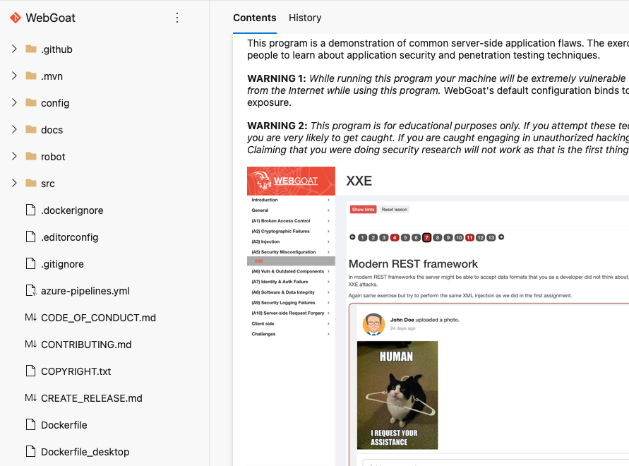

In this blog post we will explore how to create a basic reusable Azure DevOps  template to automate code analysis, using a popular SAST tool from Veracode. You would ideally want  all development teams to have a way to enable SAST scans with minimum configuration, so that they focus their efforts on remediation instead of configuring tooling in their pipelines. That is where Azure DevOps pipelines come in handy, as they cover the reusability part and thus making it a bit easier for developers.

<!-- more -->

At the same time, security tooling can be quite cumbersome to integrate properly in your CI/CD. The reasons can be many, for example lack of quality support for the CI/CD system of your choice, or suboptimal integration options. This is why,  I will present this use case with Veracode's SAST analyser in Azure DevOps.

In short, we will configure the SAST tool to be reusable through template in Azure DevOps.

<br>

## Prerequisites

For this particular example you will of course need a proprietary license from Veracode.

*Disclaimer: This is not a blog post for promoting the use Veracode. It is only a use case and meant to show the use of Azure DevOps templates.*

Then you need to install the community-backed extension for pipeline scans. You will find in in the Azure DevOps marketplace.

<br>

## Templates directory

For good practice a new repository is created where templates will be stored, and a specific folder called templates in the new repository.

<br>


<br>

The template will be stored in a yaml file within the templates directory.

```
parameters:
- name: artifacts # folder containing artifacts created by build
- name: api_id
- name: api_key
- name: profile_name #application profile name in Veracode
steps:
  - task: Veracode@3
    inputs:
      ConnectionDetailsSelection: 'Credentials' # login method 
      apiId: ${{parameters.api_id}} # the api id from parameters
      apiKey: ${{parameters.api_key}} # the api key from paramenters
      veracodeAppProfile: ${{parameters.profile_name}} # App profile
      version: '$(build.buildNumber)'
      filepath: ${{parameters.artifacts}} # path to artifacts
      importResults: true # import a summary of results
      maximumWaitTime: '360'
```

The snippet is self-explanatory and defines several inputs necessary for the Veracode scan to work. The most important one is the artifacts which should point to the archive under analysis, such as .war or .jar file and the profile_name, which is the profile name of your application in Veracode.

<br>

## Calling the template

It is now time to call the template from another pipeline. I use OWASP Webgoat, a deliberately vulnerable application to analyze its code. You can import it in Azure DevOps by importing it from [Github](https://github.com/WebGoat/WebGoat?ref=appsecguy.se).

<br>



<br>

Once this is done it is time to setup a pipeline. First, we need to build the project to create the necessary artifacts. The we will call the template and point it to the build artifact using the template parameter artifacts. The build pipeline looks as follows:

```
trigger: none

pool:
  vmImage: windows-latest

resources:
  repositories:
    - repository: appsecguy
      type: git
      name: appsecguy

steps:
  - task: Maven@4
    inputs:
      mavenPomFile: 'pom.xml'
      publishJUnitResults: true
      testResultsFiles: '**/surefire-reports/TEST-*.xml'
      javaHomeOption: 'JDKVersion'
      jdkVersionOption: '1.17'
      mavenVersionOption: 'Default'
      mavenAuthenticateFeed: false
      effectivePomSkip: false
      sonarQubeRunAnalysis: false

  # Run Veracode pipeline scan
  - template: templates/veracide-policy-scan.yml@appsecguy
    parameters:
      artifacts: './target/wegboat-2023.5-SNAPSHOT.jar' 
      Veracode_Api_Id: '$(VeracodeApiId)'
      Veracode_Api_Key: '$(VeracodeApiKey)'
```

You have to of course also define the Api Id and Key for this pipeline and then include these values as secrets that the pipeline has access to, for example using a Library.

Finally, please mention the resources code block, which includes the repository containing the templates.

<br>

### Summary

This is an example of how to utilize templates in Azure DevOps to automate SAST checks, while keeping the configuration at a central location. I have found this approach as a convenient way of making security scans work in a common way between the dev teams.

Of course, this is also an example of how to setup Veracode pipeline scan, for those using this tool.
